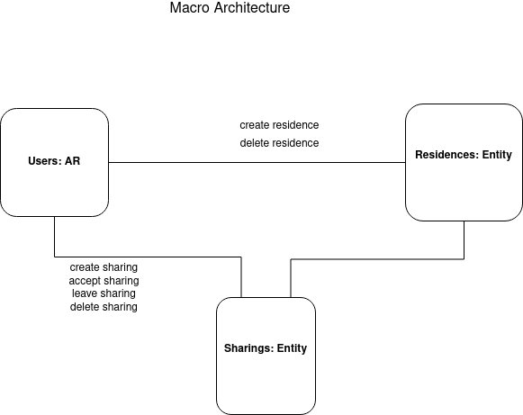

# PWEB Project 2022 - Sharing Residences Application for Refugees

## 1. User stories

### 1.1. User stories for both roles
* As a user / an administrator, I would like to be able to access the platform.
* As a user / an administrator, I would like to be able to see all sharing offers.

### 1.2. User stories for administrator only
* As an administrator, I would like to be able to delete any sharing offer.
* As an administrator, I would like to be able to view overview metrics related to how many of all sharings are accepted.
* As an administrator, I would like to be able to view overview metrics related to how many residences are added.
* As an administrator, I would like to be able to view overview metrics related to how many people have found a place to stay.

### 1.3. User stories for user
* As a user, I would like to be able to see all my residences.
* As a user, I would like to be able to add a house as a residence for sharing.
* As a user, I would like to be able to delete a residence given that I am the owner, and it is empty.
* As a user, I would like to be able to add a sharing offer given that I have added a house as a residence, and it is not already shared.
* As a user, I would like to be able to delete a sharing offer given that I am the owner, and it is not already accepted.
* As a user, I would like to be able to view overview metrics related to how many of my sharings are accepted.
* As a user, I would like to be able to view overview metrics related to how many residences I have.
* As a user, I would like to be able to view overview metrics related to how many people I have helped.

* As a user, I would like to be able to accept a sharing offer.
* As a user, I would like to be able to leave a residence given that I have booked previously.
* As a user, I would like to be able to view overview metrics related to how many bookings I have made.
* As a user, I would like to be able to view overview metrics related to how many days I have stayed.

* As a user, I would like to be able to get an email notification when someone accepts one of my sharing offers.
* As a user, I would like to be able to get an email notification when an admin deletes one of my sharing offers.
* As a user, I would like to be able to get an email notification when someone leaves one of my residences.

## 2. Domain Architecture

## 3. Macro Architecture

## 4. Backend Flow Architecture

